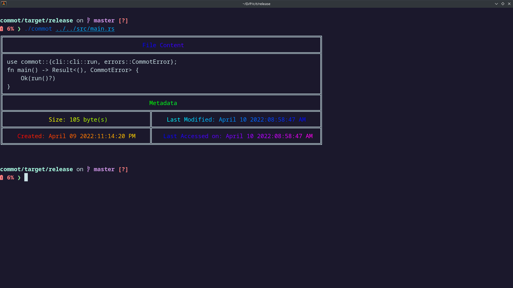

### commot

*A better alternative of the `cat` command* 


Yes you heard it right, commot gives all the metadata about file you need and the file content. When was it created? Yes. When did I made changes to it? Yes. Don't worry leave to commot it will give you all the information about the file


#### Installtion

```
$ cargo install commot
```


#### Usage


```
$ commot <FILE>
```


Example

```
$ commot main.rs
```

Output: 





#### How to make cat work like this?


```
$ alias cat="commot"
```

Its better to do this in the config file. It will automatically load when you start your device.
